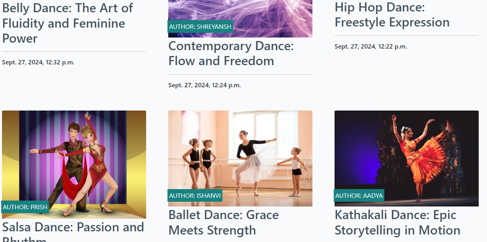
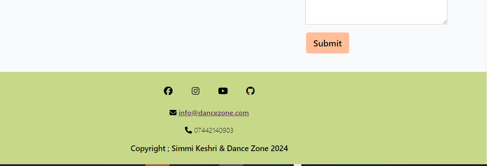

# DanceZone Blog

(Developer: Simmi Keshri)

Am I Responsive

## Live website

Link to live website: [DanceZone](https://dance-zone-0cb3194ed2ff.herokuapp.com/)

## Purpose of the project

DanceZone began as a blog dedicated to exploring the vibrant and diverse world of dance. Due to the overwhelming interest from professional dancers and enthusiasts, it has grown into a full-fledged platform offering dance class bookings alongside its engaging blog content. This full-stack website, built using the Django web framework, aims to transform passionate readers into active participants by providing easy access to a variety of dance classes.

The DanceZone website offers a seamless experience for users, featuring a blog that covers various dance styles, tips for beginners and seasoned dancers alike, and cultural insights into dance traditions worldwide. Registered users can also enjoy the convenience of booking dance classes directly through the website. The app allows users to schedule classes for different styles—from classical forms like Bharatanatyam and Ballet to contemporary styles like Hip Hop and Salsa. 

DanceZone’s goal is to inspire, educate, and connect dance enthusiasts while offering a streamlined platform to learn and practice with expert instructors. Whether you're here to read, learn, or dance, DanceZone is your ultimate destination for everything dance!

## Table of contents

- [User experience (UX)](#user-experience-ux)
   * [Key project goals](#key-project-goals)
   * [Target audience](#target-audience)
   * [User requirements and expectations](#user-requirements-and-expectations)

- [Epics and user stories](#epics-and-user-stories)
   * [Epics](#epics)
   * [User stories](#user-stories) 

- [Features](#features)
   * [Logo and navigation bar](#logo-and-navigation-bar)
   * [Hero image](#hero-image)
   * [Django alert messages](#django-alert-messages)
   * [Clear indication as to whether the user is logged in or out at all times](#clear-indication-as-to-whether-the-user-is-logged-in-or-out-at-all-times)
   * [Call to action button](#call-to-action-button)
   * [A list of blog posts](#a-list-of-blog-posts)
   * [See an individual blog post in detail](#see-an-individual-blog-post-in-detail)
   * [Pagination](#pagination)
   * [Sign in form](#sign-in-form)
   * [Register form (Sign up)](#register-form-sign-up)
   * [Sign out page](#sign-out-page)
   * [Booking page](#booking-page)
   * [Form with CRUD functionality to booking when logged in](#form-with-crud-functionality-to-book-a-makeover-when-logged-in)
   * [View the bookings I have made when I am logged in](#view-the-bookings-i-have-made-when-i-am-logged-in)
   * [Edit the bookings I have made when I am logged in](#edit-the-bookings-i-have-made-when-i-am-logged-in)
   * [Delete the bookings I have made when I am logged in](#delete-the-bookings-i-have-made-when-i-am-logged-in)
   * [View comments on posts](#view-comments-on-posts)
   * [CRUD functionality on comments when logged in](#crud-functionality-on-comments-when-logged-in)
   * [Footer](#footer)

- [Wireframes](#wireframes)
   * [Index page wireframes](#index-page-wireframes)

- [Technology used](#technology-used)
   * [Languages and framework](#languages-and-framework)
   * [Database](#database)
   * [Technologies and tools](#technologies-and-tools)

- [Database schema](#database-schema)
   * [Entity relationship diagram](#entity-relationship-diagram)

- [Testing](#testing)
- [Code validation](#code-validation)
   * [CSS](#css)
   * [JavaScript](#javascript)
   * [Python](#python)
- [Manual testing](#manual-testing)

- [Deployment](#deployment)
   * [Pre deployment](#pre-deployment)
   * [Deploying with heroku](#deploying-with-heroku)

- [Credits](#credits)
   * [Code](#code)
   * [Media](#media)

- [Acknowledgements](#acknowledgements)

## User experience (UX)

### Key project goals

-Increase awareness of the DanceZone brand through a feel-good and accessible website that offers information about all things dance, including various styles and techniques, through blog posts.
-Build a website that encourages and guides users to book dance lessons, or sign up for events directly through the platform.

### Target audience

-Users who are interested in current dance trends, techniques, and tutorials.
-Users who would like to book dance lessons, choreography, or dance performances for an upcoming event.

### User requirements and expectations

- An intuitively structured and visually appealing website that is easy to read on all screen sizes
- Navigation that is easy to use and understand whether using mobile, tablet or monitor
- Ability to quickly understand the purpose of the website
- An ability to register, login and logout
- An ability to interact with content by commenting
- An ability to read comments that have been made under blogs
- An ability to update and delete comments if desired
- An ability to find relevant information on the business and its services
- An ability to make a booking for a dance style
- An ability to see a list of their own bookings
- An ability to update and delete bookings if desired
- Easy ways to contact the dancezone
- An accessible website for all users

### Epics

1. Fully functioning home page
2. Database and admin setup
3. Register page and form
4. Login page and form
5. Navigation bar that looks different when logged in
6. Blog detail page that has different capabilities when logged in compared to when not logged 
   in
7. Log out page
8. Booking page for various dance styles, that can be only accessed when logged in. This 
   includes full front-end CRUD functionality for the user

### User stories

Open a post: As a Site User, I can click on a post so that I can read the full text.

AC1 When a blog post title is clicked on a detailed view of the post is seen.

View comments: As a Site User / Admin I can view comments on an individual post so that I can read the conversation

AC1 Given one or more user comments the admin can view them.
AC2 Then a site user can click on the comment thread to read the conversation.

Account registration: As a Site User I can register an account so that I can comment on a post.

AC1 Given an email a user can register an account.
AC2 Then the user can log in.
AC3 When the user is logged in they can comment.

Comment on a post: As a Site User I can leave comments on a post so that I can be involved in the conversation

AC1 When a user comment is approved
AC2 Then a user can reply
AC3 Given more than one comment then there is a conversation thread

Modify or delete comment on a post: As a Site User I can modify or delete my comment on a post so that I can be involved in the conversation

AC1 Given a logged in user, they can modify their comment
AC2 Given a logged in user, they can delete their comment

Booking of dance class: As a Site user I can book a class so that I can enjoy the dance style I want from the available dance style

AC1 As a user I should be able to choose from dance list available
AC2 As a user I Could choose from the date available to join the dance
AC3 As a user i could choose from the time slots available

Edit and delete dance class: As a SITE USER I can edit booking so that I Can change my choice accordingly

AC1 As a user I Can edit my preference
AC2 As a user I Can delete my booking if made mistake
AC3 As a user I Can view my bookings

Manage posts: As a Site Admin I can create, read, update and delete posts so that I can manage my blog content

AC1 Given a logged in user, they can create a blog post
AC2 Given a logged in user, they can read a blog post
AC3 Given a logged in user, they can update a blog post
AC4 Given a logged in user, they can delete a blog post

Create drafts: As a Site Admin I can create draft posts so that I can finish writing the content later

AC1 Given a logged in user, they can save a draft blog post
AC2 Then they can finish the content at a later time

Approve comments: As a Site Admin I can approve or disapprove comments so that I can filter out objectionable comments

AC1 Given a logged in user, they can approve a comment
AC2 Given a logged in user, they can disapprove a comment

Link to my Github [Project Board](https://github.com/users/SIMMI-K/projects/3/views/1)

## Features

### Logo and navigation bar

A responsive navigation bar is in place. Concentrating on 'mobile first' design, the navigation bar incorporates a clickable burger icon with a drop down menu on mobile. There is a burger icon at tablet size too, but when moving to monitor size the burger disappears and a navigation bar appears with options to navigate to pages; 'Blog' which is essentially the home page, 'About' or 'Book Makeover'. There is a clickable brand logo for all screen sizes that loads the blog page. See mobile and monitor screenshots below.

#### Mobile navigation using burger menu

#### Monitor navigation bar

### Hero image
The hero image shows the classical dance tradition 

### Django alert messages

Every time there is a change in data the user is alerted. For example when a comment is posted, when a comment is edited, when a comment is deleted, when a booking is created, when a booking is edited or when a booking is deleted. There is also an alert message displayed when a collaboration request is made. Below are 3 examples of alert messages, but there are many more shown throughout the site.

#### Django alert message example 1

The first example is a feedback notification that shows "successfully signed in as username" straight after signing in.

#### Django alert message example 2

The second example states "booking submitted! you will be notified when confirmed.

#### Django alert message example 3

The third example states "your booking has been deleted successfully!"

### Clear indication as to whether the user is logged in or out at all times

The base html contains for whether the user is logged in or not and will display "You are logged in as username" or "You are not logged in" depending on the boolean state of authentication.

#### Clear indication for when the user is logged in

#### Clear indication for when the user is logged out

### A list of blog posts

Individual blog posts are displayed under one another on mobile screens. On tablet screens there are 3 blog posts displayed in a row and 6 on a page, with the option to use a next and previous button. Large laptop screens and monitor screens have the same layout as tablet size only the pictures are bigger.

### See an individual blog post in detail

When a blog title or excerpt is clicked the post detail html is rendered displaying the same hero image that is on all pages, but also a mast head underneath the hero image with the blog title and an image that has been uploaded by a superuser. Underneath this the blog text can be seen. Underneath the blog text is a comment count, comments section and a form to add your own comment if you are a logged in user.

### Pagination

Pagination makes a long list of blog posts more manageable for users. It is comprised of 'next' and 'prev' buttons. Six blogs are shown per page on this website.

### Sign in form

This is a crispy form that asks for username and password.

### Register form (Sign up)

This is a crispy form. I styled it with a light yellow background and I removed the bullet point dots that are normally present on the password instructions (e.g. your password must contain at least 8 characters). The username and password (x2) are required fields and the email is optional.

### Sign out page

The signout page is defensive. It asks the user 'Are you sure you would like to sign out?'

### Booking

An original custom model is contained in this original custom app. The app is called 'BOOKING' and it has its own template, models, form and views.

### View comments on posts

A list of comments can be seen on individual posts when not logged in. However there is a note directing the user to 'Log in to leave a comment'. The user can create, read, edit and delete comments if they are logged in.

### CRUD functionality on comments when logged in

Full front end CRUD functionality is available on comments if the user is logged in. Every time data is created, edited or deleted a notification message pops up to give the user feedback.

### Footer

This includes social media icons, contact details (email and phone number) and copyright.

### MoSCoW

This project used the "MoSCoW" method to classify its features and requirements according to their importance towards a minimum viable product (MVP). "MoSCoW" stands for "Must have, Should have, Could have and Won't have," with each classification aiding in the prioritization of features. This method makes sure that essential components are tackled in priority order.

## Wireframes

### Index page wireframes

#### Mobile

#### Tablet

#### Monitor

## Technology Used

### Languages and framework

- [HTML5](https://developer.mozilla.org/en-US/docs/Learn/HTML "link to html mozilla documentation")
  was used to create content and structure
- [CSS](https://developer.mozilla.org/en-US/docs/Learn/CSS "link to css mozilla documentation")
  was used to add custom styles
- [JavaScript](https://developer.mozilla.org/en-US/docs/Web/javascript "link to javascript mozilla documentation") was used to dynamically reset the comment form if the reset button was clicked and to show a modal when the edit comment button was clicked
- [Django](https://www.djangoproject.com/ "link to django docs homepage") was the python framework used to develop the site

### Database

- [PostgreSQL from Code Institute](https://dbs.ci-dbs.net/ "link to postgresql from code institute") was used as the PostgreSQL database for this project

### Technologies and tools

- [VS Code](https://code.visualstudio.com/ "link to visual studio code webpage") was used as the ide for this whole project
- [Cloudinary](https://cloudinary.com/ "link to cloudinary homepage") was used to host images
- [GitHub](https://github.com/ "link to github webpage") was used to store the code files, README files and assets
- [Git](https://git-scm.com/ "link to official git website") was used as a version control software to commit and push the code to the GitHub repository
- [Heroku](https://id.heroku.com/login "link to Heroku login") was used to deploy the project
- [Bootstrap](https://getbootstrap.com/ "link to official bootstrap website") was used to quickly layout, position and size critical website features
[Google Fonts](https://fonts.google.com/ "link to official google fonts website") was used to import fonts
- [Favicon Generator](https://favicon.io/favicon-generator/ "link to official favicon generator website") was used to make an 'DZ' shaped favicon
- [Font Awesome](https://fontawesome.com/ "link to official font awesome website") was used for all icons
- [Google Chrome Developer Tools](https://developer.chrome.com/docs/devtools/overview/ "Link to official chrome developer tools website") was used for lighthouse testing, debugging and consistently checking responsiveness
- [W3C Markup Validator](https://validator.w3.org/ "link to official html validator") was used to validate all live html
- [Jigsaw CSS Validator](https://jigsaw.w3.org/css-validator/ "link to official css validator") was used to validate CSS code
- [JS Hint](https://jshint.com/ "link to official javascript validator") was used to validate JavaScript code
- [Code Institute Python Linter](https://pep8ci.herokuapp.com/ "link to official python validator") was used to validate all python code
- [Django Summernote](https://pypi.org/project/django-summernote/ "link to official summernote website") was used. This is a rich text editor plugin for Django
- [Django Crispy Forms](https://pypi.org/project/django-crispy-forms/ "link to official crispy forms website") were used throughout the project to quickly create forms
- [Chat-GPT](https://chat.openai.com/ "link to chat gpt") was used to create the text blog content. There are 9 blogs published on the DanceZone website and for each the following query was written into Chat
-[Lucidchart]for the database schema was used.

### Entity relationship diagram

In the diagram below it can be seen that User has a relationship to Post, Comment and Booking. Comment has a relationship with both User and Post.

# Testing

## Code validation

### HTML

All HTML pages were tested with the [W3C HTML Validator](https://validator.w3.org/).

#### HTML Result
| page                   | validator                                                                                                                               | result |
| ---------------------- | --------------------------------------------------------------------------------------------------------------------------------------- | ------ |
| blog                   |  

Blog Page

                          | PASS   |
| booking              |  

booking Page

             | PASS   |
| post detail logged out |  

Post Detail Logged Out

 | PASS   |
| post detail logged in  |  

Post Detail Logged In

   | PASS   |
| sign up page           |  

Register

                         | PASS   |
| sign in page           |  

Sign In

                           | PASS   |
| logout page            |  

Sign Out

                         | PASS   |
| edit booking page      |  

Edit Booking

                   | PASS   |
| delete booking page    |  

Delete Booking

        | PASS   |
| delete comment page    |  

Delete Comment

        | PASS   |

The info messages that were ignored appeared in validation, because I used the [Prettier](https://prettier.io/) plugin in VS code. Prettier is hardcoded to add trailing slashes. Since all of my attributes were quoted, there is no effect of the trailing slash. After some research and finding the following 2 links I decided that it is ok to ignore these info messages in this instance.

- [Stack overflow](https://stackoverflow.com/questions/77343449/using-of-trailing-slash-in-void-element) - information on trailing slash

### CSS

Custom CSS was put through the [W3C CSS Validator](https://jigsaw.w3.org/css-validator/).

#### CSS Result

Pass

Explanation of 3 warnings

Warning 1: Imported style sheets are not checked in direct input and file upload modes. This warning can be ignored in this instance.

- [Stack overflow](https://stackoverflow.com/questions/25946111/importing-css-is-ending-up-with-an-error) - the google style sheet is not checked in the validator

Warning 2: -webkit-transform is a vendor extension. This warning can be ignored in this instance.

- [Stack overflow](https://stackoverflow.com/questions/30607832/w3c-css-validation-error-using-calc-and-vendor-extensions) - vendor-specific extensions (mostly) do adhere to the CSS 2.1 grammar, but since they are not defined in the CSS 2.1 specification, they are marked as invalid in the validator.

Warning 3: -moz-transform is a vendor extension. This warning can be ignored in this instance.

- [Stack overflow](https://stackoverflow.com/questions/30607832/w3c-css-validation-error-using-calc-and-vendor-extensions) - vendor-specific extensions (mostly) do adhere to the CSS 2.1 grammar, but since they are not defined in the CSS 2.1 specification, they are marked as invalid in the validator.

### JavaScript

JavaScript code in the comment.js file was put through the [JSHint Validator](https://jshint.com/).

#### JS Result

The js code passed. There is 1 undefined variable: bootstrap. However, this warning can be ignored in this instance because the variable is imported with the CDN connection in the base.html file.

### Python

All python code was put through the [CI Python Linter](https://pep8ci.herokuapp.com/).

#### Python Result

| File            | Validator                                                                                                                | Result |
| --------------- | ------------------------------------------------------------------------------------------------------------------------ | ------ |
| Blog models     |  

Blog Models

        | PASS   |
| Blog views      |  

Blog Views

          | PASS   |
| Blog forms      |  

Blog Forms

          | PASS   |
| Blog urls       |  

Blog urls

            | PASS   |
| Blog admin      |  

Blog Admin

          | PASS   |
## Manual testing

Link to spreadsheet[manual testing] <a href="docs/readme_images/dancezone testing US - Sheet1.pdf" target="_blank"> manual testing spreadsheet</a>

## Deployment

All code for this project was written in visual studio integrated development environment. Github was used for version control and the application was deployed to heroku from github.

### Pre deployment

- To ensure successful deployment with heroku, it's good practice to make sure that the requirements.txt file is kept up to date so as that imported python modules are configured correctly.
- A Procfile is required to allow heroku deployment to be configured to a gunicorn web app.
- In settings.py configure the ALLOWED_HOSTS list the format ['app_name.heroku.com', 'localhost'], make sure all static files and directories are configured correctly.
- All environment variables on the env.py which gitignored on the repo must be configured correctly with the database url, cloundinary url and secret key.

### Deploying with heroku

After account setup, the steps were as follows:

- Click the "create new app" button on heroku
- Create a unique name for the app
- Select region (Europe was selected for this project)
- Click "create app"
- Select the deployment method (github was used for this project)
- Search for the github repository name (it was 1st-full-stack-project for this project)
- Click connect
- There is an option to use manual deployment or automatic deployment. Make sure main branch is selected
- In the settings tab select reveal config vars. Input the required hidden variables
- Select nodejs and python as the buildpack
- Deploy
- After the first deployment you will see a message saying "your app was successfully deployed" and there will be a "view" button to take you to your deployed application

The live link for this project can be found here - [DanceZone](https://dance-zone-0cb3194ed2ff.herokuapp.com/)

### Fork this repository:

- Go to the GitHub repository
- Click on the Fork button in the upper right-hand corner

### Clone this repository:

- Go to the GitHub repository
- Click the Code button near the top of the page
- Select 'HTTPS', 'SSH', or 'Github CLI', depending on how you would like to clone
- Click the copy button to copy the URL to your clipboard
- Open Git Bash
- Change the current working directory to where you want the cloned directory
- Type git clone and paste the URL ($ git clone https://github.com/YOUR-USERNAME/YOUR-REPOSITORY)
- Press enter to create your clone locally

Note: The difference between clone and fork is, you need permissions to push back to the original from a clone, but not a fork because a fork will be completely your own new project.

## Credits

### Code

[CI walkthrough I think therefore I blog](https://github.com/Code-Institute-Solutions/blog/tree/main/12_views_part_3/05_edit_delete) - The CI walkthrough repo was relied upon heavily, however I additionally created 1 whole custom app with associated custom models to suit the dance theme of the website. The app I added was a booking for dance classes where the user could make a booking for dance styles they like if they were logged in. This custom app has full front end CRUD functionality.

[CI previous project on statement beauty blog] -The inspiration came from this beauty blog to make something customise to my favourite dances from around the world and some classical dances from India.

[CHATGPT for many fixes, errors, codes, post descriptions]

### Media

All the media images are taken from; [Adobe Stock] (https://stock.adobe.com/uk/)

### [Security_Key]

I am aware that I accidently pushed security key to github but now I have removed from the settings.py and generated a new key to envy.py file.
## Acknowledgements

Thank you to friends, family specially my 4yr son for showing a big cooperation during meetings.
Also thank you to my mentor and CI cohort facilitator specially ELAINE, MARK and JOHN